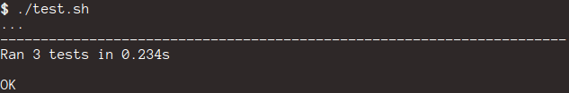

sublime-plugin-tests |Build status|
===================================

.. |Build status| image:: https://travis-ci.org/twolfson/sublime-plugin-tests.png?branch=master
   :target: https://travis-ci.org/twolfson/sublime-plugin-tests
   :alt: Build Status

Testing framework for Sublime Text plugins

This was built to create a platform to test plugins against multiple versions of Sublime Text.

Getting Started
---------------
Install the module with: ``pip install sublime_plugin_tests``

Then, write your tests:

.. code:: python

    # Load in test framework
    from sublime_plugin_tests import framework

    # Define a TestCase
    class TestLeftDelete(framework.TestCase):
      def test_left_delete_single(self):
          # Each test function *must* return Python with a `run` function
          # `run` will be run inside Sublime Text. Perform your assertions etc there.
          return """
    # Use ScratchView utility provided by `sublime_plugin_tests`
    from utils.scratch_view import ScratchView

    def run():
      # Generate new scratch file
      scratch_view = ScratchView()
      try:
          # Update the content and selection `ab|c`
          scratch_view.set_content('abc')
          scratch_view.set_sel([(2, 2)])

          # Delete one character to the left `a|c
          scratch_view.run_command('left_delete')

          # Assert the current content
          assert scratch_view.get_content() == 'ac'
      finally:
          # No matter what happens, close the view
          scratch_view.destroy()
    """

.. code:: bash

    $ # Run tests via nosetests
    $ nosetests
    .
    ----------------------------------------------------------------------
    Ran 1 test in 0.076s

    OK

Travis CI integration
'''''''''''''''''''''

Currently, only Sublime Text 2 is supported via `Travis CI`_. Sublime Text 3 test cases are currently functioning locally and inside of Vagrant but not inside of Travis.

To run your tests against Sublime Text 2 in `Travis CI`_, put this in your ``.travis.yml``:

.. _Travis CI: https://travis-ci.org/

.. code::yml

    language: python
    python:
    - "2.7"

    install:
    # Install Sublime Text 2
    - sudo add-apt-repository ppa:webupd8team/sublime-text-2 -y
    - sudo apt-get update
    - sudo apt-get install sublime-text -y
    - sudo ln -s /usr/bin/subl /usr/bin/sublime_text

    # List Sublime Text info for debugging
    - sublime_text --version

    # Install dev dependencies
    - pip install sublime-plugin-tests

    # Install our plugin
    - mkdir -p ~/.config/sublime-text-2/Packages/
    - ln -s $PWD ~/.config/sublime-text-2/Packages/YOUR_PLUGIN_NAME

    before_script:
    # Generate a screen buffer to collect Sublime Text window
    - export DISPLAY=:99.0
    - sh -e /etc/init.d/xvfb start

    script:
    # Run our tests
    - SUBLIME_TESTS_AUTO_KILL=TRUE ./test.sh

Documentation
-------------
framework.TestCase
''''''''''''''''''
``framework.TestCase`` extends `Python's unittest.TestCase`_. Tests can be skipped and set up/torn down as you normally would. The key difference is the string you return **will not** be run in the same context and not have access to the assertions (yet...).

.. _`Python's unittest.TestCase`: http://docs.python.org/2/library/unittest.html#unittest.TestCase

utils.selection.split_selection
'''''''''''''''''''''''''''''''
``utils.selection.split_selection`` break up a string by selection markers into ``content`` and ``selection``.

.. code:: python

    split_selection(input)
    """
    @param {String} input Python to parse selection indicators out of
    @returns {Dictionary} ret_obj Container for selection and content
    @return {List} ret_obj['selection'] List of tuples for start/end position of selections
    @return {String} ret_obj['content'] Python with selection characters removed
    """

Example
.......

Input:

.. code:: python

    split_selection("""
    def abc|():
        pas|s
    """)

Output:

.. code:: python

    {
      'content': """
    def abc():
        pass
    """,
      'selection': [(7, 7), (18, 18)]
    }

utils.scratch_view.ScratchView
''''''''''''''''''''''''''''''
``utils.scratch_view.ScratchView`` is a class for creating a temporary view to work on. This is meant to run in the context of Sublime Text and not in the framework.

When initialized, Sublime Text will open a new file in the active window (not saved to local disk). When you are done, it is strongly encouraged to run ``ScratchView#destroy`` to clean up your Sublime Text window.

.. code:: python

    # Open temporary file inside of Sublime Text's active window
    tmp_view = ScratchView()

ScratchView#run_command
.......................
Run a command in the context of a ``ScratchView``. The function signature is the same as in the `Sublime Text documentation`_.

.. _`Sublime Text documentation`:
.. _view_docs: http://www.sublimetext.com/docs/2/api_reference.html#sublime.View

.. code:: python

    # Run `left_delete` command inside of `tmp_view`
    tmp_view.run_command('left_delete')

ScratchView#set_content, #get_content, #clear_content
.....................................................
Methods to adjust the content of a ``ScratchView``.

.. code:: python

    # `set_content` replaces all of the content.
    tmp_view.set_content('Hello World!')

    # `get_content` returns the current content.
    tmp_view.get_content() # 'Hello World!'

    # `clear_content` deletes all of the content.
    tmp_view.clear_content()

ScratchView#set_sel, #get_sel, #clear_sel
.........................................
Methods to adjust the selection of a ``ScratchView``.

.. code:: python

    # `set_sel` replaces the selection.
    # For convenience, tuples and lists are coerced to `sublime.Region`.
    tmp_view.set_sel([(6, 6), (7, 7)])

    # `get_sel` returns the current selection.
    tmp_view.get_sel() # RegionSet([Region(6, 6), Region(7, 7)])

    # `clear_sel` deselects everything.
    tmp_view.clear_sel()

ScratchView#destroy
...................
Closes scratch view for clean up. This also guarantees no pop-up will be run when closing.

.. code:: python

    # Close `tmp_view`
    tmp_view.destroy()

ScratchView#view
.....................................................
If you would like to access the underlying `sublime.View`_, it can be accessed via the ``view`` attr.

.. _`sublime.View`: `view_docs`_

.. code:: python

    tmp_view.view # sublime.View instance

Architecture
------------
Framework takes each test function, wraps it in a test harness, runs it, and asserts whether the harness saw an error or not.

The test harness generates a temporary Sublime Text plugin which runs your test in the context of Sublime. This harness is launched via a CLI invocation of Sublime Text.

The output and assertions of each test function are reported back to ``nosetests`` which prints to ``stdout`` and exits.

Contributing
------------
In lieu of a formal styleguide, take care to maintain the existing coding style. Add unit tests for any new or changed functionality. Test via ``./test.sh``.

If you would like to headlessly run the tests, this repository can be used with `Vagrant`_.

..

    Currently, it is only configured for Sublime Text 3.

.. _Vagrant: http://vagrantup.com/

.. code:: bash

    $ vagrant up
    [default] Importing base box 'precise64'...
    ...
    $ vagrant ssh
    vagrant@precise64:~$ cd /vagrant
    vagrant@precise64:/vagrant$ ./test.sh
    ...
    ----------------------------------------------------------------------
    Ran 3 tests in 2.651s

    OK

Donating
--------
Support this project and `others by twolfson`_ via `gittip`_.

.. image:: https://rawgithub.com/twolfson/gittip-badge/master/dist/gittip.png
   :target: `gittip`_
   :alt: Support via Gittip

.. _`others by twolfson`:
.. _gittip: https://www.gittip.com/twolfson/

Unlicense
---------
As of Sep 05 2013, Todd Wolfson has released this repository and its contents to the public domain.

It has been released under the `UNLICENSE`_.

.. _UNLICENSE: UNLICENSE
